# Mental Health Awareness

Website project by Oscar Sabet

## Table of Contents

1. [Introduction](#introduction)
2. [Planning](#planning)
3. [Development](#development)
4. [Testing](#testing)
5. [Site Contents](#contents)
6. [Repository & Project Board](#repository)
7. [Sources](#sources)
8. [Full Screenshots](#screenshots)

## Introduction

The website makes use of HTML, CSS, bootstrap and a little JS. It's split into 5 pages with a home page. This site is my submission for AI Augmented FullStack Bootcamp HTML/CSS/Bootstrap - Individual Project.

## Planning

### Design & Purpose

This website is to provide a calm and welcoming design, which is fully responsive and compatible with all device form factors. It should offer resources to educate the public about mental health conditions, symptoms, treatments, and data about mental health conditions.

The website is designed to be intuitive and easy to use, with simple navigation and information which is well organized and easy to browse.

The main users are expected to be people who are seeking information and guidance about mental health. this will be people who are suffering from mental health problems or people who are concerned about there loved ones. The site should have a comprehensive array of information and guidance.

### User Stories

- As a visitor, I want to access the website on my mobile device, so that I can get information on the go.
- As a visitor, I want to find resources for self-care, so that I can take steps to improve my own mental health.
- As a visitor, I want to learn about mental health, so that I can better understand mental health issues.
- As a visitor, I want to find contact information for mental health services, so that I can seek help if needed.
- As a visitor, I want to read personal stories and testimonials, so that I can feel connected and less alone in my experiences.
- As a visitor, I want to find information on how to support someone with mental health issues, so that I can help my loved ones.

### Project board

A project board was used during development. 

[Github Project Board](https://github.com/users/oscar-sabet/projects/2)

### Wireframe

The website was changed between planning and release. this was done since there were problems with the planned layout which were found after the website was developed.

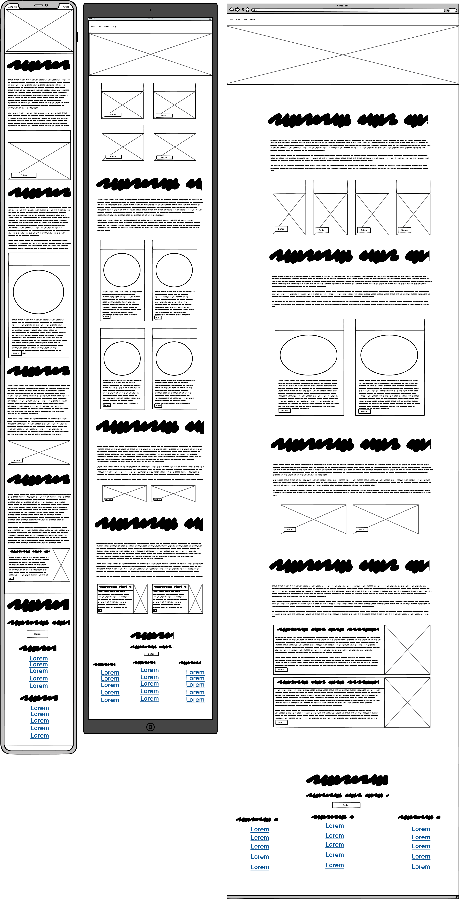

## Development

The website was developed using HTML & CSS with the bootstrap framework.

There was also some JS used to add the dark mode switch and add a smooth animation when using links within pages.

A project board was set up and used during development.

a github repo was used for version control.

The website uses thorough customization of styling for the bootstrap classes.

The home page was created first and this was used as template for the other pages. During development of the home page it became apparent that the wireframe design was going to be too busy so the design was changed.

An AI was used to generate the sites content and assist in development. particularly to automate repetitive tasks like filling in several cards with content.

## Testing

The website was thoroughly tested before completion.

- Manual code review to find bugs
- Manual code review to check accessability requirements eg. alt text on images
- check site with W3S HTML/CSS validator
- All links work and external links open in a new tab
- Manually test site locally. for example, rendering issues, images loading, navigation links, scale at breakpoints, check console for errors in dev tools, etc.

### Known Bugs

**FILL ME**

## Contents

### Navigation bar + Hero

The website contains a Navbar with a logo & brand name on the left. Links to all pages and a dropdown menu for in-page navigation are on the right, alongside a button for toggling dark mode.

#### Desktop View

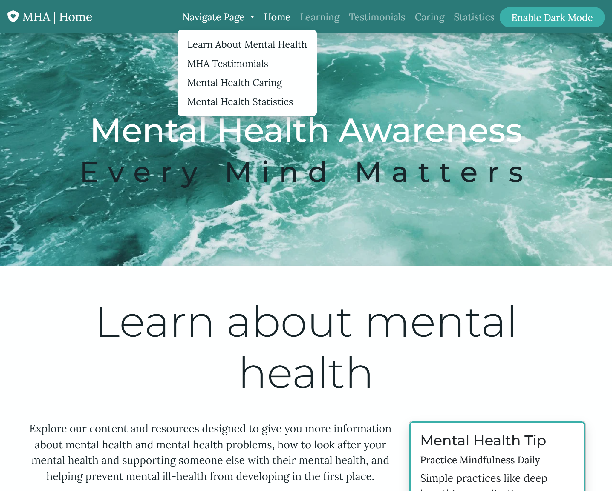

#### Mobile view

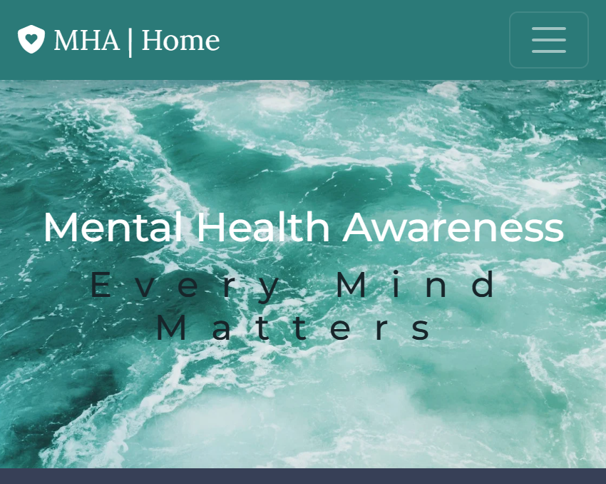

### footer

The footer contains a button to open a contact form modal, helpful links to external resources, as well as, the usual contact information, social media links & address.

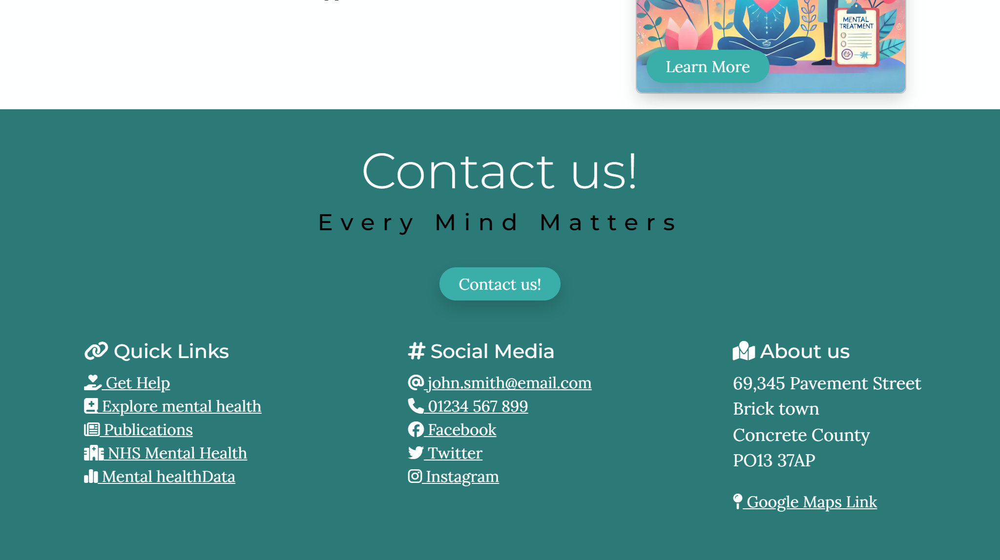

#### The contact form modal

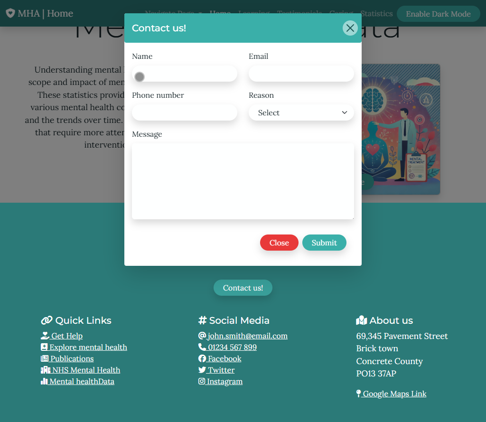

### Content Pages

The user can access a large variety of relevant content on the site. The home page displays a brief introduction to each page along with links that lead the relevant section on that page.

#### Learning

This page is designed to give the user a large amount of information but well organized and presented to prevent overwhelming the user and allow easy navigation. This is achieved through the use of a tabbed interface and accordion to keep the information organized.

The first tab is arranged into responsive cards with the other tabs using an accordion.

##### The learning page - basics tab

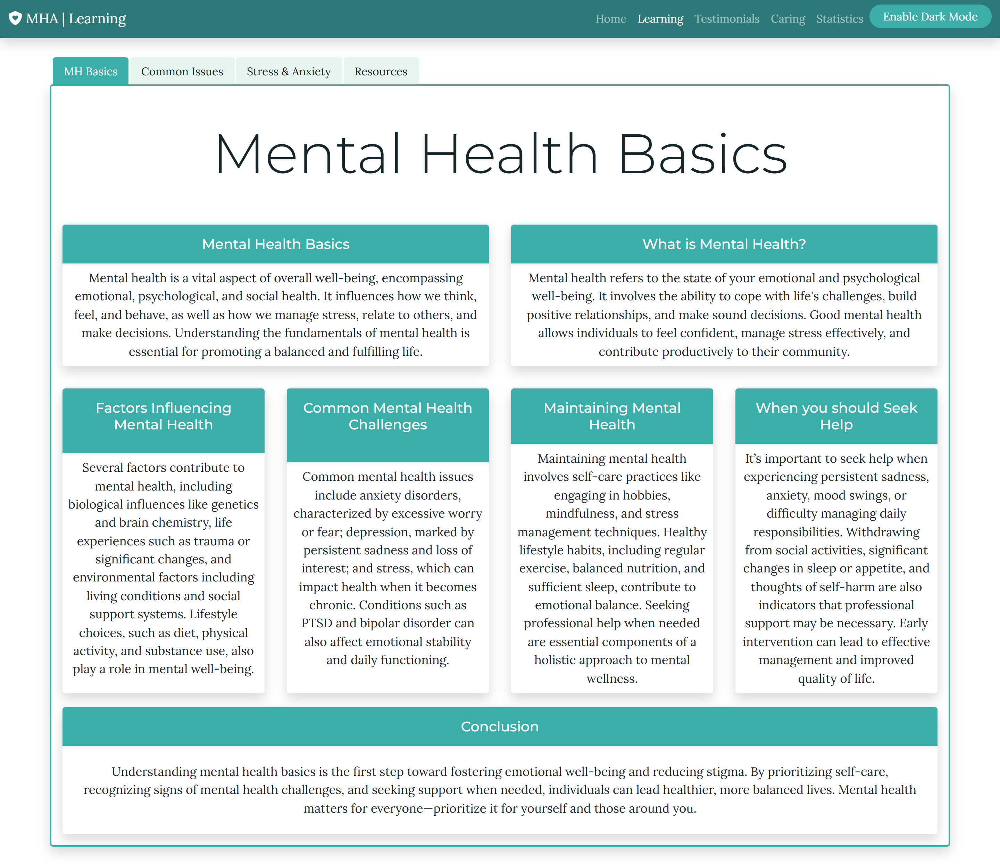

##### The learning page - common-issues tab

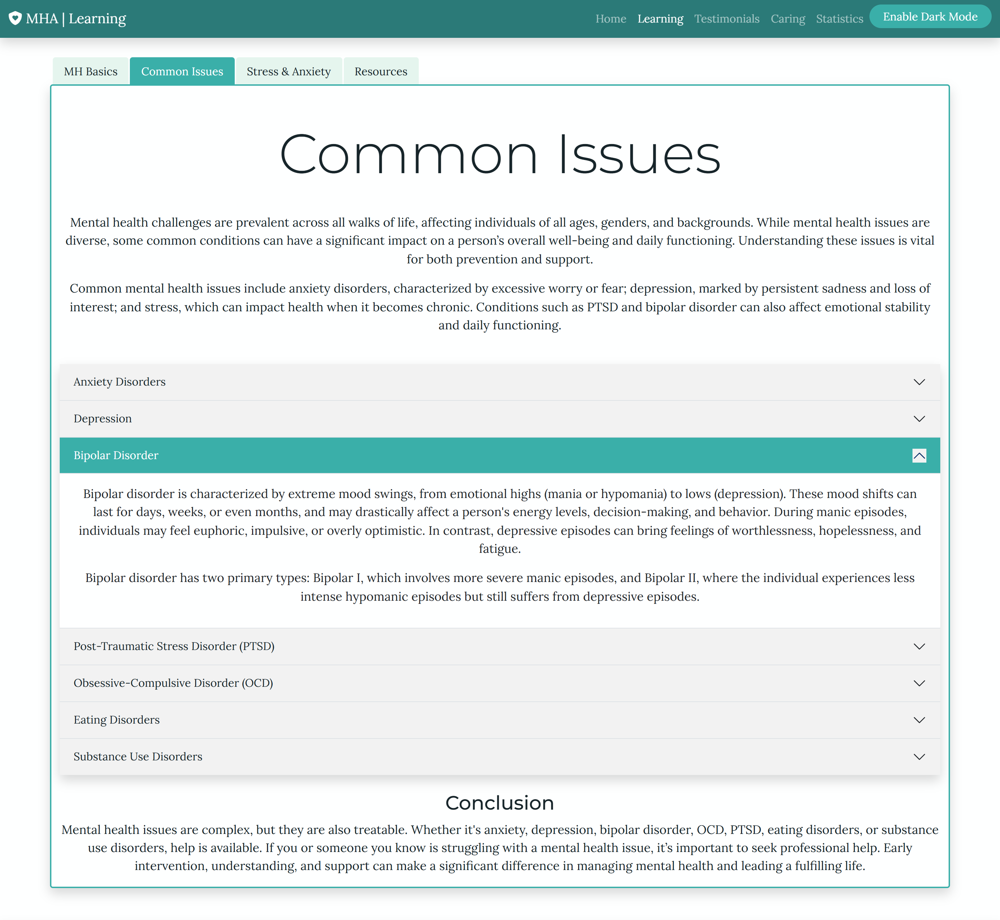

#### Testimonials

The testimonials page contains some past stories from previous users. This helps to build trust and credibility and reassure the user that this is site for them. They can also be used receive authentic feedback and highlight key benefits of the site.

the site uses custom cards with a profile view on the left. It also contains a modal form for allowing users to submit there own testimonial.

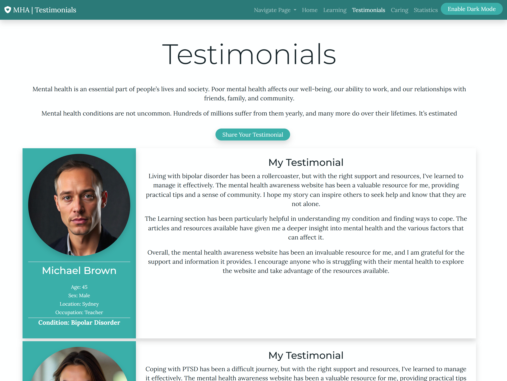

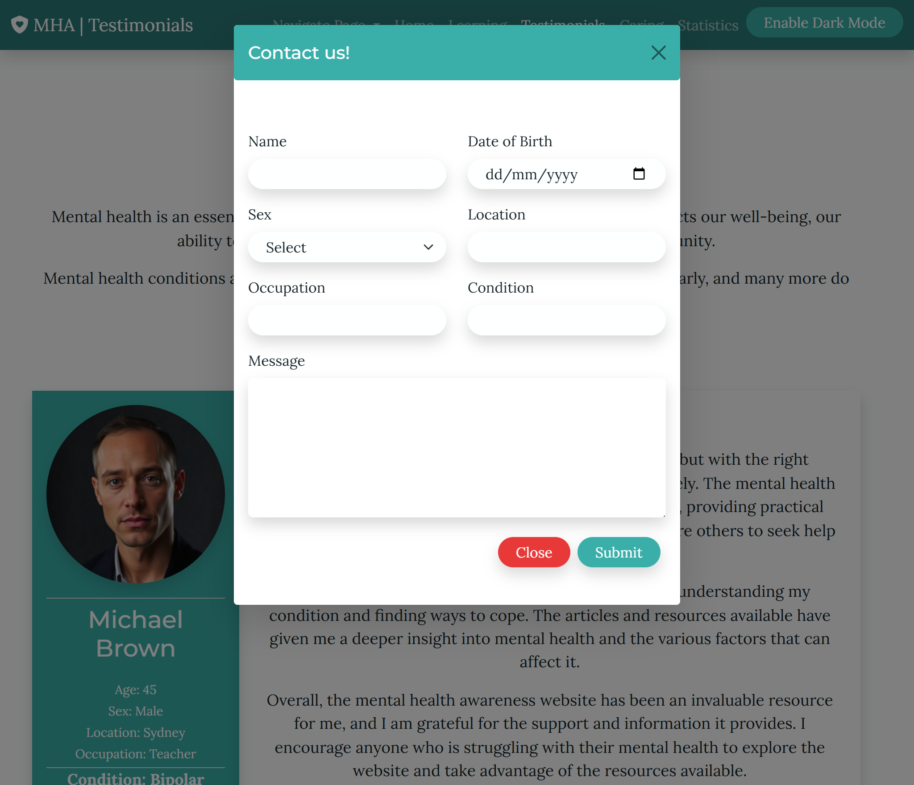

#### Caring

The caring page is split into two pages, self-care & caring for others. The pages are made up of a short article along-side responsive cards for quick absorbing of information.  

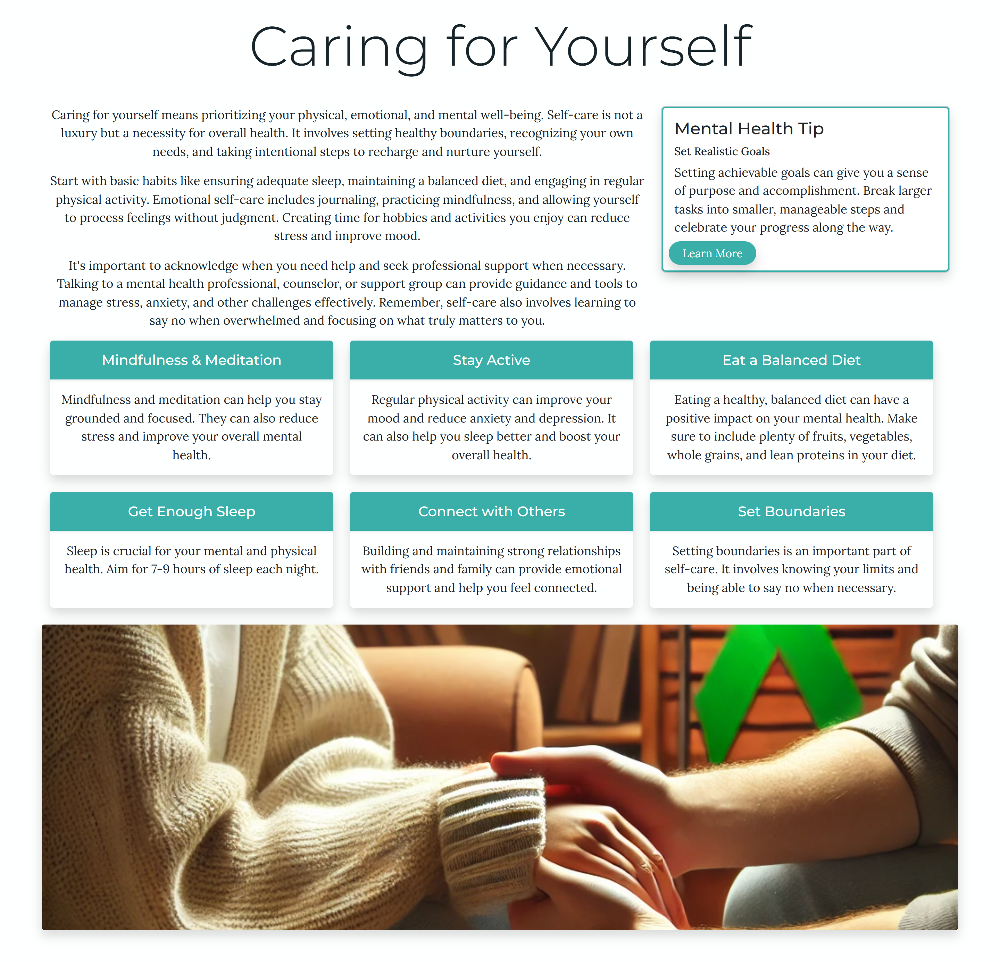

#### Statistics

The statistics page contains a brief article followed by interactive graphs.  

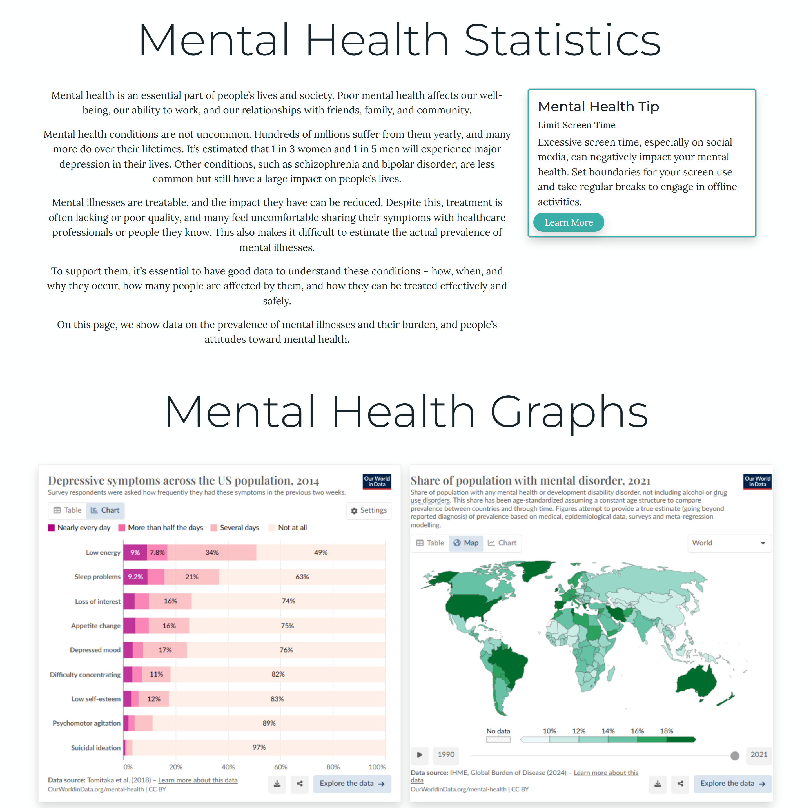

# Repository

The Github repo can be found here.

[Github Repo](https://github.com/oscar-sabet/project-mha)

The project Board can be found here.

[Github Project Board](https://github.com/users/oscar-sabet/projects/2)

## sources

All code was either coded by me or some by an AI. The content of the site is 100% AI generated.

## screenshots

### Homepage full Mobile

### Homepage Full Desktop

### Homepage Full Tablet

### Testimonials Full Desktop

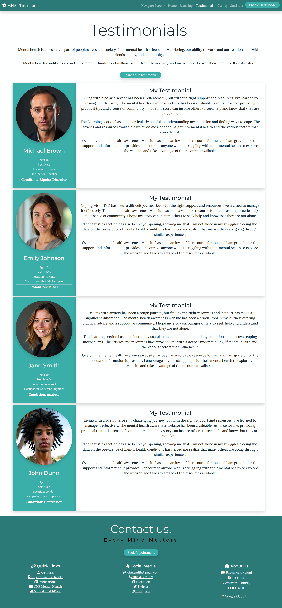

### Statistics Full Desktop

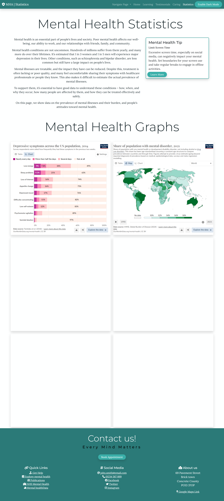

### Learning Full Desktop

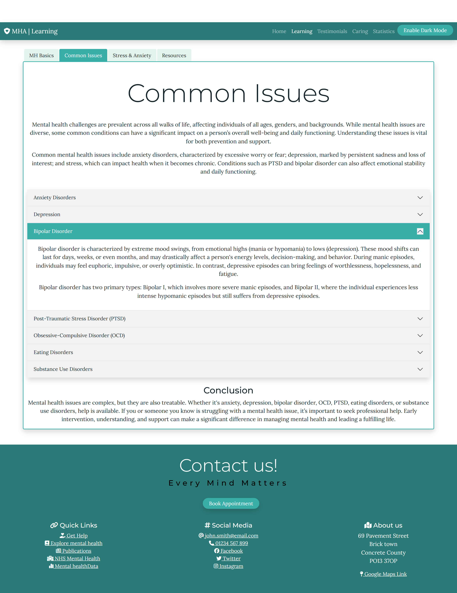

### Caring Full Desktop

